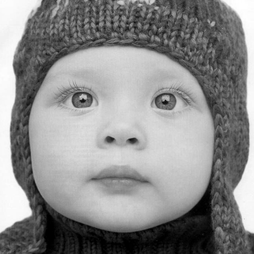
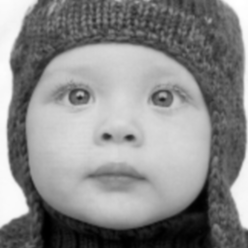

# SRCNN pytorch implementation
------

This implement the paper **Image Super-Resolution Using Deep Convolutional Networks** in Pytorch. The paper and the code (in Caffe with Matlab wrapper) can be found at the offical [website](http://mmlab.ie.cuhk.edu.hk/projects/SRCNN.html). 

The SRCNN architechture is as follows.

``Low resolution Img -> Conv1 -> ReLU -> Conv2 -> ReLu -> Conv3 -> High resolution Img`` 


## Usage
The easiest way to execute the code is:
- Train: ``python main.py train``
- Test: ``python main.py test``
- Both train and test: ``python main.py both``

To display the training info, use ``python main.py train --verbose``

After training phase the best model w.r.t. validation set is stored in ``trained_model.pt``, this will be used for test phase.

After testing phase, the input (low resolution), output (high resolution), label (original resolution) images of test dataset are saved to ``Result`` folder. The average PSNR (between output and label) is shown on console. 

### Original image:



### Bicubic interpolated image:



### SRCNN output image:


## Detail


```
usage: main.py [-h] [-c S] [--train-path PATH] [--val-path PATH]
               [--test-path PATH] [-i I] [-l L] [-s S] [-b B] [-n N] [-v]
               PHASE

SRCNN-pytorch implementation The easiest way to execute the project is For
training: python main.py train For testing: python main.py test

positional arguments:
  PHASE                 train or test or both

optional arguments:
  -h, --help            show this help message and exit
  -c S, --scale S       interpolation scale
  --train-path PATH     path of train data
  --val-path PATH       path to val data
  --test-path PATH      path to test data
  -i I, --input_size I  size of input subimage for the model, the default
                        value is aligned to the label size and the CNN
                        architecture, make sure you understand the network
                        architecture if you want to change this value
  -l L, --label_size L  size of label subimage used to compute loss in CNN.
                        The default value is aligned to the input and the CNN
                        architecture, make sure you understand the network
                        architecture if you want to change this value
  -s S, --stride S      This is not the stride in CNN, this is stride used for
                        image subsampleing
  -b B, --batch-size B  batch size used for training
  -n N, --num-epochs N  number of training epochs
  -v, --verbose         print training information
```

>The project is referred to this [repo](https://github.com/tegg89/SRCNN-Tensorflow)
